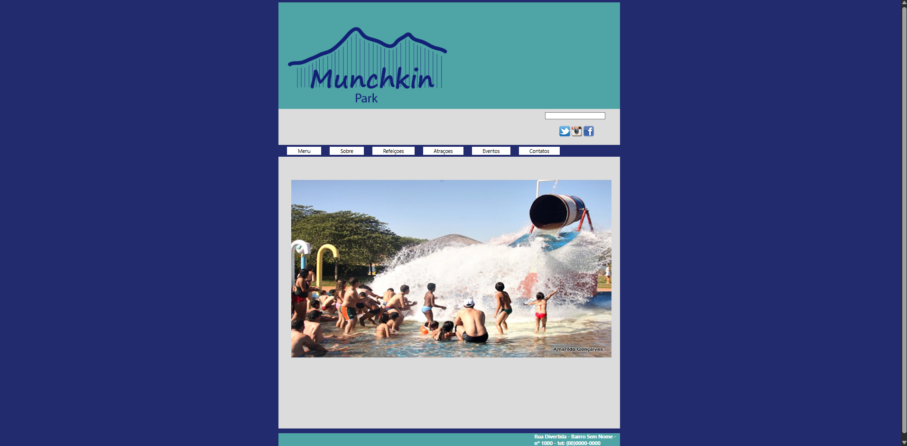

🌊 Desenvolvimento de Site para Parque de Diversões Aquático — Projeto Front-End
📌 Sobre o Projeto

Este foi o primeiro projeto da minha trajetória como desenvolvedora front-end, desenvolvido ao longo de um mês e responsável por despertar meu interesse definitivo pela área.

O objetivo foi criar um site institucional completo para um parque de diversões aquático, contendo as seguintes páginas:

Menu

Sobre

Atrações

Refeições

Eventos

Contato (com espaço para cadastro do cliente)

🛠️ Tecnologias Utilizadas

HTML5

CSS3

Adobe Dreamweaver

🎯 O Que Aprendi Durante o Desenvolvimento

Por ser meu primeiro projeto, todo o aprendizado aconteceu na prática. Trabalhei conceitos fundamentais como:

Estruturação com HTML semântico

Organização de arquivos e pastas

Estruturação de layout

Aplicação de estilos com CSS

Alinhamento, espaçamento e hierarquia visual

Separação clara de seções e navegação entre páginas

Esse processo foi essencial para construir minha base em desenvolvimento front-end.

🎨 Identidade Visual e Escolhas de Design

A paleta de cores foi pensada estrategicamente.
Por se tratar de um parque aquático, o objetivo era transmitir leveza, frescor e conexão com a água.

Optei por tons de azul para reforçar essa identidade visual, criando uma atmosfera que remete a piscinas, brinquedos aquáticos e diversão em um ambiente refrescante. Essa decisão ajudou a manter harmonia e coerência estética no projeto.

🚧 Desafios Enfrentados

Meu maior desafio foi conciliar a curva de aprendizado com o prazo de um mês, já que este foi o primeiro site que desenvolvi.

Essa experiência me ensinou sobre:

Organização

Foco

Persistência

Gestão de tempo

🚀 Próximos Passos

Esta versão inicial ainda não é responsiva.
Pretendo evoluir o projeto aplicando técnicas modernas como:

Flexbox

CSS Grid

Layout Responsivo

Com isso, o objetivo é oferecer uma experiência consistente também em dispositivos móveis.

💡 Significado do Projeto

Este projeto representa o início da minha jornada na tecnologia.
Ele marca o momento em que descobri que o desenvolvimento front-end é a área que desejo seguir e mostra o quanto evoluí tecnicamente desde então.

🔥 O que eu fiz aqui estrategicamente

✔ Organizei em seções escaneáveis
✔ Mantive sua voz
✔ Reduzi repetição
✔ Deixei profissional
✔ Acrescentei visão de evolução

📸 Preview

